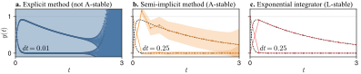

# Probabilistic Exponential Integrators - Experiments

<p align="center">

</p>

This repo contains the experiment code for the paper
"Probabilistic Exponential Integrators" ([arxiv](https://arxiv.org/abs/2305.14978)).

---

__The functionality of the paper will be made available as part of the [ProbNumDiffEq.jl](https://nathanaelbosch.github.io/ProbNumDiffEq.jl) package.__
It provides a range of fast probabilistic ODE solvers for first- and second-order ODEs and DAEs - and soon also probabilistic exponential integrators.
Check out the [getting started](https://nathanaelbosch.github.io/ProbNumDiffEq.jl/stable/getting_started/) tutorial!

---

## Running the experiments
The experiments are located in `./experiments/`.
Code should be run from the root directory directly.

First open `julia`, activate the local environment, and instantiate it to install all the packages:
```
julia> ]
(v1.9) pkg> activate .
(v1.9) pkg> instantiate
```
and you can quit the `pkg` environment by hitting backspace.

To run a julia script from the Julia REPL,
```
julia> include("experiments/1_logistic/run.jl")
```
